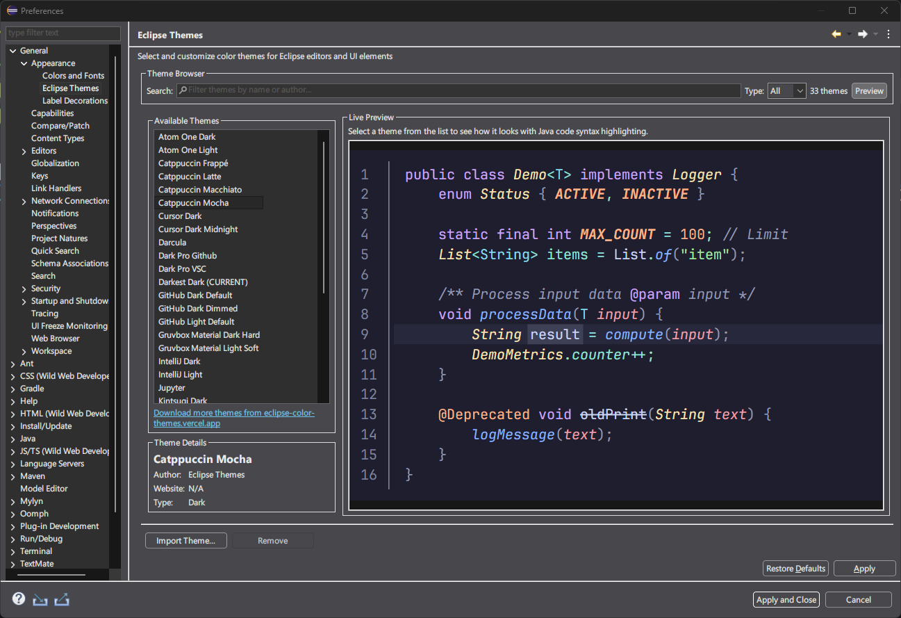
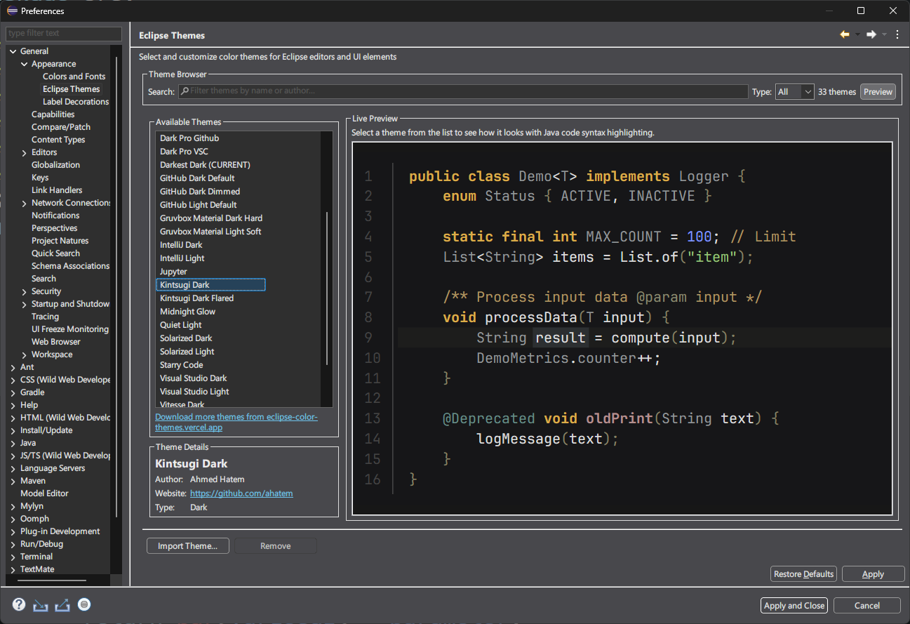

# Eclipse Themes

A simple plugin for finding and applying editor color themes in the Eclipse IDE.

This project started when the original `eclipsecolorthemes.org` website went offline. To help the community, I built a new, modern, open-source alternative: **[eclipse-color-themes.vercel.app](https://eclipse-color-themes.vercel.app/)**.

I then realized the old plugin was also outdated, so I decided to build this one to provide a simple, direct way to use the themes from the new site.

## ✨ Features

- **Dozens of popular themes** included right out of the box.
- A link to **[download hundreds more](https://eclipse-color-themes.vercel.app/)** from the community collection.
- A clean preference page with a **live preview** for your code.
- **Import support** for your own favorite `.xml` theme files.
- Syntax highlighting support for Java, C++, XML, and more via an adapter system.

## 📸 Screenshots

## 🚀 Installation

### From the Eclipse Marketplace (Recommended)

1.  Go to `Help -> Eclipse Marketplace...`.
2.  Search for `Eclipse Themes`.
3.  Click **Install**.

### From the Update Site

1.  Go to `Help -> Install New Software...`.
2.  Click **Add...** and enter the URL: `https://ahatem.github.io/eclipse-themes-plugin/`
3.  Give it a name (like `Eclipse Themes`) and complete the installation.

## 💻 Usage

1.  Go to `Window -> Preferences` (or `Eclipse -> Settings...` on macOS).
2.  Navigate to `General -> Appearance -> Eclipse Themes`.
3.  Pick a theme from the list to see how it looks.
4.  Click **Apply and Close** to set your new editor theme.

## 🤝 Contributing

Contributions are always welcome! The best way to help is to add a new theme to the collection.

Please read the [**Contributing Guidelines**](CONTRIBUTING.md) to get started.

## 📜 License

This project is licensed under the **Eclipse Public License 2.0**. See the [LICENSE](LICENSE) file for details.

## 🙏 Acknowledgments

- This project wouldn't exist without the original [Eclipse Color Theme](https://github.com/eclipse-color-theme/eclipse-color-theme) plugin.
- I also learned a lot from the clean architecture of the [BetterThemes](https://github.com/TheKodeToad/BetterThemes/) project by TheKodeToad.
- And a huge thank you to everyone who has created and shared a theme with the community.
